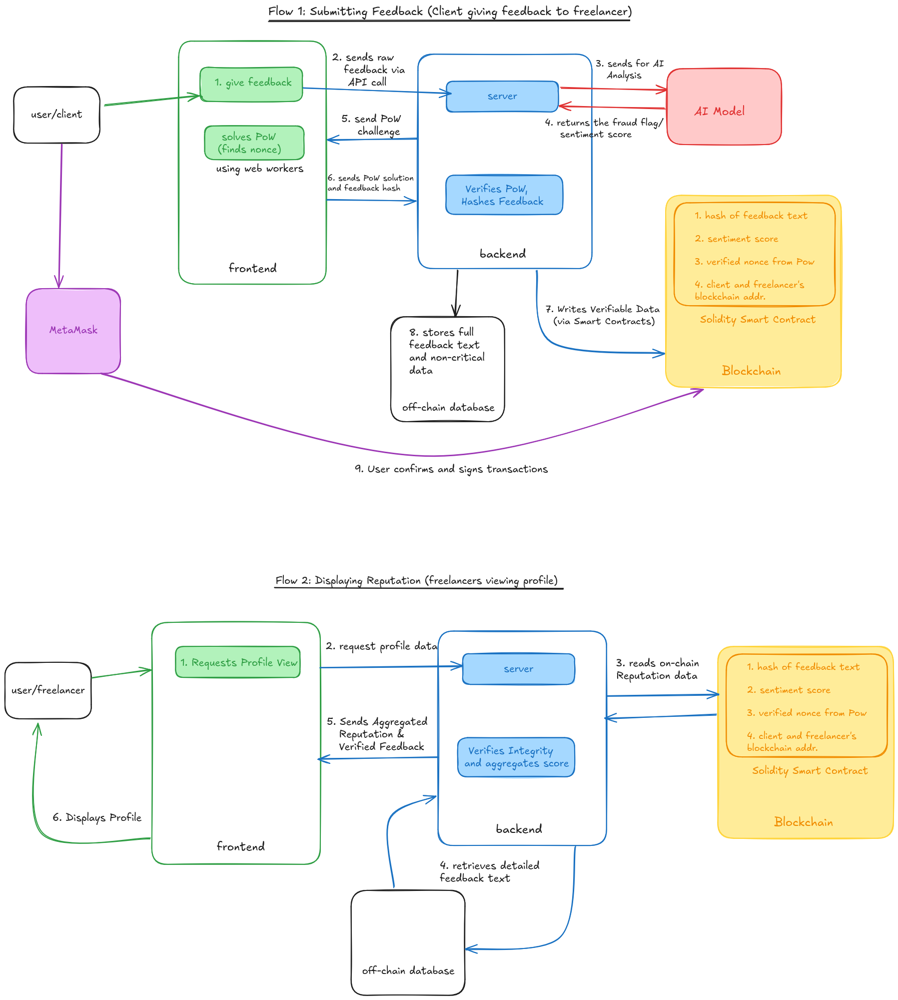

# VeriTrust: AI-Powered Decentralized Reputation for the Gig Economy

## Project Overview

VeriTrust is a decentralized application (DApp) designed to revolutionize reputation management in the gig economy. It tackles the flaws of centralized systems by combining blockchain's immutability with AI-driven sentiment analysis and fraud detection. The goal is to provide freelancers with a verifiable, portable, and tamper-proof professional reputation, enhanced by an application-level Proof of Work (PoW) to deter spam. This project aims to deliver a functional prototype.

## Architecture & Flow

Below is a high-level diagram illustrating how the Frontend, Backend, AI Models, Blockchain, and Off-chain Database interact within the VeriTrust system.

# lenskart-kk
